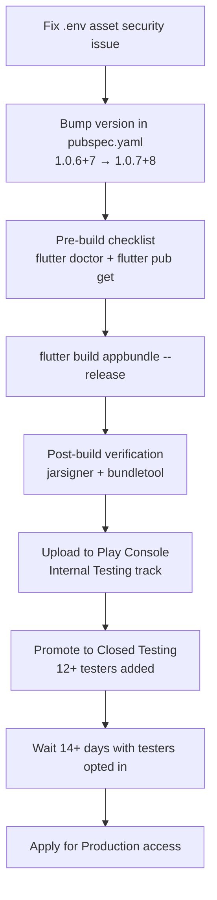

# Design Document: Release Build Preparation

## Overview

This document describes the technical design for preparing and publishing a signed Android App Bundle (AAB) for the Mindfulness Garden app (`com.mindfulgarden.mindfulness_garden`). The release increments the version from `1.0.6+7` to `1.0.7+8`, produces a ProGuard-minified, upload-key-signed AAB, and walks through the Google Play Console upload flow — starting with Internal Testing, then Closed Testing (12+ testers, 14+ days) to unlock Production access.

The design also addresses a security concern: `.env` is currently listed as a Flutter asset, which means it is bundled into the AAB and shipped to users. This must be resolved before the release build.

---

## Architecture

The release pipeline is a linear sequence of manual steps executed on the developer's Windows machine. There is no CI/CD automation in scope for this release; all steps are performed via the Flutter CLI, Android SDK tools, and the Google Play Console web UI.



The signing configuration is already wired end-to-end:

```
pubspec.yaml (version field)
    ↓ flutter.versionCode / flutter.versionName
android/app/build.gradle.kts (defaultConfig)
    ↓ signingConfigs.release
android/key.properties (storeFile, storePassword, keyAlias, keyPassword)
    ↓ upload-keystore.jks (C:\Users\Sourav\upload-keystore.jks)
```

---

## Components and Interfaces

### 1. Version Source — `pubspec.yaml`

The single source of truth for version information. The `version` field uses the format `MAJOR.MINOR.PATCH+buildNumber`. Flutter's Gradle plugin reads this and injects `flutter.versionName` (the `MAJOR.MINOR.PATCH` part) and `flutter.versionCode` (the `buildNumber` integer) into the Android build.

**Current value:** `1.0.6+7`  
**Target value:** `1.0.7+8`

### 2. Build Configuration — `android/app/build.gradle.kts`

Configures the Android build. Key settings for the release build:

| Setting | Value | Purpose |
|---|---|---|
| `compileSdk` | `36` | Compile against Android 14 APIs |
| `minSdk` | `26` | Minimum Android 8.0 |
| `targetSdk` | `flutter.targetSdkVersion` | Resolved by Flutter plugin |
| `versionCode` | `flutter.versionCode` | Derived from pubspec.yaml |
| `versionName` | `flutter.versionName` | Derived from pubspec.yaml |
| `isMinifyEnabled` | `true` | ProGuard code shrinking |
| `isShrinkResources` | `true` | Resource shrinking |
| `signingConfig` | `signingConfigs.release` | Upload key signing |

### 3. Signing Credentials — `android/key.properties`

Supplies keystore credentials to the Gradle build. This file is correctly excluded from git via `.gitignore`. The `storeFile` uses a Windows absolute path (`C:\Users\Sourav\upload-keystore.jks`), which is correct for a Windows-only build machine.

**Important:** This file must never be committed to version control. The `.gitignore` already excludes it.

### 4. ProGuard Rules — `android/app/proguard-rules.pro`

Prevents ProGuard from stripping classes required at runtime. Current rules cover:

- Flutter engine and plugins
- Firebase / Google Play Services
- Google Mobile Ads
- RevenueCat (`com.revenuecat.purchases.**`)
- Hive (`com.hive.**`)
- Kotlin stdlib and coroutines
- App model classes (`com.mindfulgarden.mindfulness_garden.**`)
- ML Kit (non-Latin language models suppressed with `-dontwarn`)

### 5. Asset Security — `.env` in `pubspec.yaml`

**Current problem:** `pubspec.yaml` lists `.env` as a Flutter asset:

```yaml
assets:
  - .env          # ← THIS SHIPS IN THE AAB
```

Any file listed under `flutter.assets` is bundled verbatim into the AAB and is extractable by anyone who downloads the app. Even though the current `.env` contains placeholder values, the pattern is dangerous: if real API keys (OpenAI, RevenueCat, AdMob, Firebase) are placed in `.env`, they will be exposed.

**Resolution:** Remove `.env` from the assets list. The `flutter_dotenv` package is used to load this file, so the app code must be updated to handle the missing file gracefully, or secrets must be migrated to a safer mechanism (see Error Handling section).

### 6. Google Play Console

The web portal used to manage releases. The upload flow for this release:

1. **Internal Testing** — immediate availability, no review, for the developer and close collaborators
2. **Closed Testing (Alpha)** — invite-only, requires 12+ opted-in testers for 14+ days to unlock Production
3. **Production** — public release, requires passing the closed testing prerequisite

---

## Data Models

### Version String Format

```
version: MAJOR.MINOR.PATCH+buildNumber
         └─────────────────┘ └────────┘
              versionName    versionCode (integer)
```

For `1.0.7+8`:
- `versionName` = `"1.0.7"` (displayed to users in Play Store)
- `versionCode` = `8` (integer, must be strictly greater than previous upload)

### AAB Manifest Embedding

The Flutter Gradle plugin embeds version information into the Android manifest at build time:

```xml
<!-- AndroidManifest.xml (inside AAB) -->
<manifest
    android:versionCode="8"
    android:versionName="1.0.7"
    ...>
```

### Key Properties File Format

```properties
storePassword=<keystore password>
keyPassword=<key password>
keyAlias=upload
storeFile=C:\Users\Sourav\upload-keystore.jks
```

---

## Step-by-Step Release Process

### Step 0: Fix the `.env` Asset Security Issue

Before building, remove `.env` from the Flutter assets list in `pubspec.yaml`.

**Edit `pubspec.yaml`** — remove the `.env` line:

```yaml
# BEFORE
assets:
  - .env
  - assets/images/
  - ...

# AFTER
assets:
  - assets/images/
  - ...
```

Then update any code that calls `await dotenv.load()` to handle the case where the file is absent, or migrate the values to compile-time constants / environment variables injected at build time via `--dart-define`.

> **Note:** If the app currently relies on `flutter_dotenv` to load API keys at runtime, the safest migration path for this release is to hardcode the non-sensitive config values as Dart constants and pass sensitive keys via `--dart-define=KEY=value` at build time (they are compiled into the binary, not shipped as a readable asset file).

### Step 1: Bump the Version

Edit `pubspec.yaml`, line 4:

```yaml
# BEFORE
version: 1.0.6+7

# AFTER
version: 1.0.7+8
```

No changes are needed in `build.gradle.kts` — it reads `flutter.versionCode` and `flutter.versionName` automatically.

### Step 2: Pre-Build Checklist

Run these commands in order from the project root:

```powershell
# 1. Verify Flutter, Android SDK, and Java 17 are available
flutter doctor -v

# Expected: No errors under "Android toolchain"
# Check for: Android SDK, licenses accepted, build-tools installed

# 2. Resolve all dependencies
flutter pub get

# Expected: exit code 0, no version conflicts reported
```

**What to look for in `flutter doctor` output:**

- `[✓] Android toolchain` — Android SDK found, licenses accepted
- `[✓] Android Studio` or `[✓] VS Code` — IDE detected (not blocking)
- Java version should be 17 (`java -version` if needed)

If `flutter doctor` reports Android license issues, run:

```powershell
flutter doctor --android-licenses
# Accept all licenses with 'y'
```

### Step 3: Build the Release AAB

```powershell
flutter build appbundle --release
```

**Expected output:**
```
Running Gradle task 'bundleRelease'...
✓ Built build\app\outputs\bundle\release\app-release.aab (XX.X MB)
```

**Output file location:**
```
build\app\outputs\bundle\release\app-release.aab
```

The build applies:
- ProGuard minification (`isMinifyEnabled = true`)
- Resource shrinking (`isShrinkResources = true`)
- Release signing with `upload-keystore.jks`

**If the build fails with a ProGuard error**, the output will contain lines like:
```
warning: ... references unknown class ...
ERROR: R8: ...
```
Check `android/app/proguard-rules.pro` and add the appropriate `-keep` or `-dontwarn` rule for the flagged class.

### Step 4: Post-Build Verification

#### 4a. Verify the AAB is signed

```powershell
# From the project root
jarsigner -verify -verbose -certs build\app\outputs\bundle\release\app-release.aab
```

**Expected output includes:**
```
jar verified.
```

Look for the certificate DN — it should match the `keyAlias=upload` entry in your keystore. If you see `jar is unsigned`, the signing config was not applied.

#### 4b. Validate the AAB structure with bundletool

Download `bundletool.jar` from https://github.com/google/bundletool/releases if not already available.

```powershell
# Validate the bundle
java -jar bundletool.jar validate --bundle=build\app\outputs\bundle\release\app-release.aab

# Expected: no errors
```

#### 4c. Verify version code in the manifest

```powershell
# Extract APKs to inspect (creates a temporary .apks file)
java -jar bundletool.jar build-apks `
  --bundle=build\app\outputs\bundle\release\app-release.aab `
  --output=temp_output.apks `
  --mode=universal

# Rename and unzip to inspect
Rename-Item temp_output.apks temp_output.zip
Expand-Archive temp_output.zip -DestinationPath temp_apks

# Check the manifest of the universal APK
# Use aapt2 or apktool to read AndroidManifest.xml
aapt2 dump badging temp_apks\universal.apk | Select-String "versionCode|versionName|minSdk"
```

**Expected output:**
```
package: name='com.mindfulgarden.mindfulness_garden' versionCode='8' versionName='1.0.7'
sdkVersion:'26'
```

Clean up:
```powershell
Remove-Item temp_output.zip, temp_apks -Recurse
```

#### 4d. Verify ABI coverage

```powershell
java -jar bundletool.jar build-apks `
  --bundle=build\app\outputs\bundle\release\app-release.aab `
  --output=abi_check.apks `
  --mode=default

# List the generated APKs
Rename-Item abi_check.apks abi_check.zip
Expand-Archive abi_check.zip -DestinationPath abi_apks
Get-ChildItem abi_apks -Recurse -Filter "*.apk" | Select-Object Name

# Expected: APKs for arm64-v8a and x86_64 among others
Remove-Item abi_check.zip, abi_apks -Recurse
```

---

## Google Play Console Upload Flow

### Phase 1: Internal Testing (Immediate)

Internal Testing has no review delay and is available immediately after upload. Use this to confirm the AAB is accepted by Play Console before setting up Closed Testing.

1. Go to [Google Play Console](https://play.google.com/console) → select **Mindfulness Garden**
2. Navigate to **Testing → Internal testing**
3. Click **Create new release**
4. Under **App bundles**, click **Upload** and select `build\app\outputs\bundle\release\app-release.aab`
5. Play Console will process the AAB (typically 1–5 minutes)
6. Verify the displayed **Version code** is `8` and **Version name** is `1.0.7`
7. Add release notes (optional for internal testing)
8. Click **Save** → **Review release** → **Start rollout to Internal testing**

**What Play Console checks on upload:**
- Signing key matches the registered upload key
- `versionCode` is strictly greater than any previous upload on this track
- `minSdk` is compatible with the app's declared device support
- AAB structure is valid

### Phase 2: Closed Testing (Alpha) — Required for Production Access

Closed Testing is the gate before Production. Google requires at least **12 testers opted in** for at least **14 consecutive days**.

#### Setting up the Closed Testing track

1. Navigate to **Testing → Closed testing**
2. Click **Create track** (or use the default **Alpha** track)
3. Click **Manage testers**
4. Under **Testers**, add a Google Group or individual email addresses
   - You need at least **12 Google accounts** that will accept the opt-in invitation
   - Create a Google Group (e.g., `mindfulness-garden-testers@googlegroups.com`) and add 12+ members for easier management
5. Click **Save**

#### Publishing to Closed Testing

1. Click **Create new release** on the Closed testing track
2. Upload the same AAB (or promote from Internal Testing: **Promote release → Closed testing**)
3. Add release notes
4. Click **Save** → **Review release** → **Start rollout to Closed testing (Alpha)**

#### Tester opt-in process

After publishing:
1. Play Console sends opt-in invitation emails to all testers
2. Each tester must click the opt-in link and install the app from the Play Store
3. The **14-day timer starts from the date the track is first published**, not from when testers opt in
4. Testers who opt in after the track is published still count toward the 12-tester minimum, as long as they are opted in when you apply for production access

#### Uploading updates during Closed Testing

You can upload new AABs to the Closed Testing track at any time with incremented version codes. **This does not reset the 14-day timer.** The timer is based on when the track was first published.

```
Example timeline:
Day 0:  Publish Closed Testing with versionCode=8 (1.0.7+8)
Day 3:  Upload versionCode=9 (1.0.8+9) with bug fixes → timer still at Day 3
Day 14: Apply for production access (timer satisfied)
```

### Phase 3: Applying for Production Access

Once the prerequisites are met:

1. Navigate to **Testing → Closed testing**
2. Play Console shows a checklist:
   - ✅ 12+ testers opted in
   - ✅ Track active for 14+ days
   - ✅ Policy compliance
3. Click **Apply for production access**
4. Fill in the application form (app description, content rating, target audience)
5. Google reviews the application (typically a few days)

**If prerequisites are not yet met**, the "Apply for production access" button is grayed out and Play Console displays:
- Current opted-in tester count vs. required 12
- Days remaining until the 14-day requirement is satisfied

---

## Correctness Properties

*A property is a characteristic or behavior that should hold true across all valid executions of a system — essentially, a formal statement about what the system should do. Properties serve as the bridge between human-readable specifications and machine-verifiable correctness guarantees.*

This feature involves a build pipeline and Google Play Console interactions. The testable properties are limited to the version management logic and build output fidelity — the parts that are our code and vary meaningfully with input. Play Console behavior, environment checks, and signing verification are integration/smoke tests, not property-based tests.

### Property 1: Version String Round-Trip

*For any* valid `pubspec.yaml` version string in the format `MAJOR.MINOR.PATCH+buildNumber`, the Flutter build system SHALL derive a `versionName` equal to `MAJOR.MINOR.PATCH` and a `versionCode` equal to `buildNumber` (as an integer), and these values SHALL be embedded verbatim in the built AAB's Android manifest.

**Validates: Requirements 3.1, 5.3**

### Property 2: Version Code Monotonicity

*For any* two version strings `A+N` and `B+M` where `M > N`, the `versionCode` derived from `B+M` SHALL be strictly greater than the `versionCode` derived from `A+N`, ensuring that incrementing the build number in `pubspec.yaml` always produces an AAB that Play Console will accept as a newer release.

**Validates: Requirements 3.2**

### Property 3: Version Name Semantic Versioning Compliance

*For any* version field value in `pubspec.yaml`, the `versionName` portion (before the `+`) SHALL match the pattern `^\d+\.\d+\.\d+$`, ensuring it is always a valid semantic version string that Play Console can display correctly.

**Validates: Requirements 3.4**

### Property 4: Build Configuration Fidelity

*For any* release build, the `minSdkVersion` embedded in the AAB manifest SHALL equal `26`, matching the value declared in `android/app/build.gradle.kts`, ensuring the app is never accidentally published with a different minimum SDK requirement.

**Validates: Requirements 6.3**

---

## Error Handling

### Signing Errors

| Error | Cause | Resolution |
|---|---|---|
| `storeFile not found` | `key.properties` has wrong path or file moved | Verify `C:\Users\Sourav\upload-keystore.jks` exists; update path if moved |
| `jar is unsigned` | Signing config not applied to release build type | Verify `signingConfig = signingConfigs.getByName("release")` in `buildTypes.release` |
| `Keystore was tampered with, or password was incorrect` | Wrong `storePassword` or `keyPassword` | Verify credentials in `key.properties` |
| `Certificate mismatch` on Play Console upload | Wrong keystore used | Ensure `upload-keystore.jks` is the same key registered with Play Console |

### ProGuard Errors

| Error | Cause | Resolution |
|---|---|---|
| `Missing class` warning treated as error | Third-party library references optional class | Add `-dontwarn com.example.OptionalClass` to `proguard-rules.pro` |
| App crashes after release build | ProGuard stripped a required class | Add `-keep class com.example.RequiredClass { *; }` |
| `R8: Type ... was not found` | Reflection-based class loading | Add `-keep` rule for the class and its members |

### Version Code Errors

| Error | Cause | Resolution |
|---|---|---|
| `Version code already exists` on Play Console | `versionCode` not incremented | Increment the `+N` part in `pubspec.yaml` |
| `Version code must be greater` | Uploaded an older build | Ensure `pubspec.yaml` has a higher build number than any previous upload |

### `.env` Asset Errors

| Error | Cause | Resolution |
|---|---|---|
| `DotEnvNotFoundException` at runtime | `.env` removed from assets but code still calls `dotenv.load()` | Update code to use `--dart-define` values or handle missing file gracefully |
| API keys exposed in AAB | `.env` still listed as asset | Remove `.env` from `pubspec.yaml` assets list before building |

---

## Testing Strategy

This feature is a build pipeline, not application logic. The testing approach is therefore dominated by smoke tests, integration tests, and manual verification steps rather than unit or property-based tests.

### Smoke Tests (Pre-Build)

Run before every release build:

1. `flutter doctor -v` — no Android toolchain errors
2. `flutter pub get` — exit code 0, no dependency conflicts
3. Verify `pubspec.yaml` version field is `1.0.7+8` (or the intended new version)
4. Verify `android/key.properties` has all four fields populated
5. Verify `C:\Users\Sourav\upload-keystore.jks` exists on disk
6. Verify `isMinifyEnabled = true` and `isShrinkResources = true` in `build.gradle.kts`
7. Verify `.env` is NOT listed in `pubspec.yaml` assets

### Integration Tests (Post-Build)

Run after `flutter build appbundle --release`:

1. `jarsigner -verify` — confirms AAB is signed
2. `bundletool validate` — confirms AAB structure is valid
3. `aapt2 dump badging` on extracted APK — confirms `versionCode=8`, `versionName=1.0.7`, `minSdk=26`
4. `bundletool build-apks --mode=default` — confirms `arm64-v8a` and `x86_64` APKs are generated

### Property-Based Tests

For the version management logic (Requirements 3.1, 3.2, 3.4, 5.3), property-based tests can be written using the `test` package with a property-testing library such as [`glados`](https://pub.dev/packages/glados) (Dart).

Each property test should run a minimum of **100 iterations**.

**Tag format:** `// Feature: release-build-preparation, Property {N}: {property_text}`

**Property 1 test sketch** (version round-trip):
```dart
// Feature: release-build-preparation, Property 1: Version string round-trip
// For any valid pubspec.yaml version string MAJOR.MINOR.PATCH+N,
// versionName == "MAJOR.MINOR.PATCH" and versionCode == N
test('version string round-trip', () {
  Glados3(any.positiveInt, any.positiveInt, any.positiveInt)
    .test((major, minor, patch) {
      final buildNumber = major + minor + patch + 1; // ensure > 0
      final versionString = '$major.$minor.$patch+$buildNumber';
      final parsed = parseFlutterVersion(versionString);
      expect(parsed.versionName, equals('$major.$minor.$patch'));
      expect(parsed.versionCode, equals(buildNumber));
    });
});
```

**Property 2 test sketch** (version code monotonicity):
```dart
// Feature: release-build-preparation, Property 2: Version code monotonicity
// For any two build numbers N < M, versionCode(M) > versionCode(N)
test('version code monotonicity', () {
  Glados2(any.positiveInt, any.positiveInt)
    .test((n, delta) {
      final m = n + delta + 1; // m > n always
      final v1 = parseFlutterVersion('1.0.0+$n');
      final v2 = parseFlutterVersion('1.0.0+$m');
      expect(v2.versionCode, greaterThan(v1.versionCode));
    });
});
```

**Property 3 test sketch** (semver compliance):
```dart
// Feature: release-build-preparation, Property 3: Version name semver compliance
test('version name is valid semver', () {
  Glados3(any.nonNegativeInt, any.nonNegativeInt, any.nonNegativeInt)
    .test((major, minor, patch) {
      final versionString = '$major.$minor.$patch+1';
      final parsed = parseFlutterVersion(versionString);
      expect(parsed.versionName, matches(RegExp(r'^\d+\.\d+\.\d+$')));
    });
});
```

### Manual Verification (Play Console)

These steps cannot be automated and must be verified manually:

1. AAB upload accepted without signing mismatch
2. Play Console displays correct `versionCode=8` and `versionName=1.0.7`
3. `minSdk=26` shown in device compatibility section
4. Closed Testing track shows 12+ opted-in testers
5. 14-day timer progress visible in Play Console checklist
6. "Apply for production access" button becomes active after prerequisites are met
